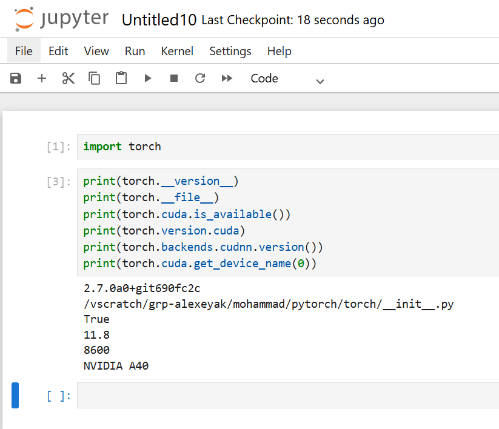

# Installing PyTorch on UB CCR

In this repository, I'll show how to have and use the latest version of PyTorch from their github repository on CCR via Jupyter. Well, it should be straightforward via creating a new virtual environment and then installing it simply through cloning its wheel files `pip install torch torchvision torchaudio --index-url https://download.pytorch.org/whl/cu118` as the CUDA version on CCR is `11.8`. But that will not work as the `torch.cuda.is_available()` returns `False`. 

Here are my instructions but I have to say a couple of points for installation and usage of **PyTorch v2.7**. It requires a newer version of `libstd++` as a couple of its submodules (such as `onxx`) require `GLIBCXX` higher than `3.4.29` which is available on CCR:

```bash
module load foss
strings /cvmfs/soft.ccr.buffalo.edu/versions/2023.01/easybuild/software/Core/gcccore/11.2.0/lib64/libstdc++.so.6 | grep 'GLIBCXX'
```

This made me reinstall my own version of `gcc 13.2.0` only to get the correct `libstd++.so*` files in my `LD_LIBRARY_PATH`. To install that, you need to do the following (I've put the path explicitly in this readme file so you can follow better but you need to change them accordingly):

```bash
module load foss
wget https://www.cp2k.org/static/downloads/gcc-13.2.0.tar.gz
tar xvf gcc-13.2.0.tar.gz
cd gcc-13.2.0
./contrib/download_prerequisites 
mkdir obj
cd obj
../configure --prefix=/vscratch/grp-alexeyak/mohammad/soft/gcc \
--libdir=/vscratch/grp-alexeyak/mohammad/soft/gcc/lib \
--enable-languages=c,c++,fortran \
--disable-multilib --disable-bootstrap \
--enable-lto \
--enable-plugins \
# Make and install it to those paths
make -j8
make install 
```

Now, connect to an interactive session with GPU:
```bash
salloc --account=alexeyak \
       --partition=debug --qos=debug \
       --clusters=ub-hpc \
       --time=1:00:00 \
       --nodes=1 \
       --ntasks-per-node=1 \
       --cpus-per-task=1 \
       --mem=8000 \
       --gres=gpu:nvidia_a40:1
```

I used the `debug` cluster with an `A40` GPU. Now, follow these instructions as follows:
```bash
cd /vscratch/grp-alexeyak/mohammad
python -m venv test
source test/bin/activate
git clone --recursive https://github.com/pytorch/pytorch
cd pytorch
```
Now, load the modules and set the paths (you can also download your own version of CUDA and cuDNN locally but setting up the `$CUDA*` paths is awkward so I used the currently installed version on CCR):
```bash
module load foss
# Load the NVIDIA CUDA 11.8
module load cuda 
# Load the NVIDIA CUDA deep neural network library
module load cudnn
module load imkl
export LD_LIBRARY_PATH=/cvmfs/soft.ccr.buffalo.edu/versions/2023.01/easybuild/software/Core/cuda/11.8.0/targets/x86_64-linux/lib:$LD_LIBRARY_PATH
# Here I referenced to the lib64 of the new compiled gcc13.2.0
export LD_LIBRARY_PATH=/vscratch/grp-alexeyak/mohammad/soft/gcc/lib64:$LD_LIBRARY_PATH
export LD_LIBRARY_PATH=/cvmfs/soft.ccr.buffalo.edu/versions/2023.01/easybuild/software/Core/gcccore/11.2.0/lib64:$LD_LIBRARY_PATH
export LD_LIBRARY_PATH=/cvmfs/soft.ccr.buffalo.edu/versions/2023.01/easybuild/software/Core/cudnn/8.6.0.163-CUDA-11.8.0/lib:$LD_LIBRARY_PATH
export LD_LIBRARY_PATH=/cvmfs/soft.ccr.buffalo.edu/versions/2023.01/easybuild/software/avx512/Compiler/gcc/11.2.0/flexiblas/3.0.4/lib:$LD_LIBRARY_PATH
```
Let's make the PyTorch:
```bash
pip install -r requirements.txt
pip install ipykernel
pip install notebook
# The GPU did not have enough of memory so let's keep the MAX_JOBS=8
MAX_JOBS=8 USE_CUDA=ON python setup.py develop
```
And then, test it via:
```python
$ python
>>> import torch
>>> print(torch.__version__)
'2.7.0a0+git690fc2c'
>>> print(torch.cuda.is_available())
True
>>> print(torch.version.cuda)
11.8
>>> print(torch.backends.cudnn.version())
8600
>>> print(torch.cuda.get_device_name(0))
NVIDIA A40
```

But how to use it with Jupyter notebook? You need to create a module path in your `$HOME` directory, I called it `my_modules` and source it in the `~/.bashrc` file:
```bash
module use /user/mshakiba/my_modules
```
Then, in that folder, create a module file `myjupyterX.lua` with the following content:
```lua
whatis("Description: Pytorch")
whatis("Version: 2.7")
whatis("Category: ML")

 execute {cmd="module purge", modeA={"load"}} -- Unload everything that is loaded by CCR including foss, jupyter, python, and ipykernel
 execute {cmd="module load gcc", modeA={"load"}}
 execute {cmd="module load cuda", modeA={"load"}}
 execute {cmd="module load cudnn", modeA={"load"}}
 execute {cmd="module load imkl", modeA={"load"}}
 execute {cmd="source /vscratch/grp-alexeyak/mohammad/test/bin/activate", modeA={"load"}}
```
and add the following to your `~/.bashrc` so they remain in your environmental variables when loading Jupyter notebook on CCR:
```bash
export LD_LIBRARY_PATH=/cvmfs/soft.ccr.buffalo.edu/versions/2023.01/easybuild/software/Core/cuda/11.8.0/targets/x86_64-linux/lib:$LD_LIBRARY_PATH
export LD_LIBRARY_PATH=/vscratch/grp-alexeyak/mohammad/soft/gcc/lib64:$LD_LIBRARY_PATH
export LD_LIBRARY_PATH=/cvmfs/soft.ccr.buffalo.edu/versions/2023.01/easybuild/software/Core/gcccore/11.2.0/lib64:$LD_LIBRARY_PATH
export LD_LIBRARY_PATH=/cvmfs/soft.ccr.buffalo.edu/versions/2023.01/easybuild/software/Core/cudnn/8.6.0.163-CUDA-11.8.0/lib:$LD_LIBRARY_PATH
export LD_LIBRARY_PATH=/cvmfs/soft.ccr.buffalo.edu/versions/2023.01/easybuild/software/avx512/Compiler/gcc/11.2.0/flexiblas/3.0.4/lib:$LD_LIBRARY_PATH
export PYTHONPATH=/vscratch/grp-alexeyak/mohammad/pytorch:$PYTHONPATH
export LD_LIBRARY_PATH=/vscratch/grp-alexeyak/mohammad/pytorch:$LD_LIBRARY_PATH
export PYTHONPATH=/vscratch/grp-alexeyak/mohammad/test/lib/python3.10/site-packages:$PYTHONPATH
export LD_LIBRARY_PATH=/vscratch/grp-alexeyak/mohammad/test/lib:$LD_LIBRARY_PATH
```
And in the **Extra Modules To Load with Jupyter** box on OnDemand enter `myjupyterX`. That's it! And it should work. No need to create your own Jupyter kernel (although you can but not necessary)!

It will open the Jupyter notebook with latest version and the results: 


